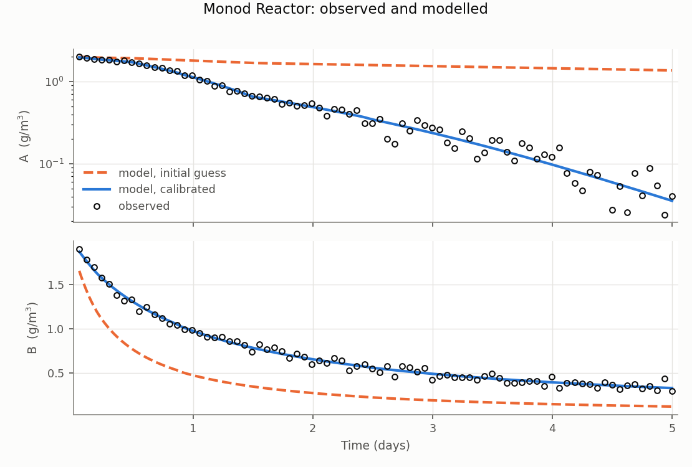

# Case 2: Monod and second-order decay

From `Reaction_Example.ohq`. A reactor with time-varying inflow (`StepFlow.txt`)
holds two constituents decaying by different kinetics:

    A:  rate = k_A * A / (K_s + A)        Monod, temperature dependent
    B:  rate = k_B * B^2                  second order

`k_A` carries an Arrhenius factor of 1.05 driven by
`Temperature_for_Rxn_example.txt`, so the case exercises temperature-dependent
reaction parameters as well.

## The estimation problem

| Parameter | Truth | Start | Range | Searched in |
|---|---:|---:|---|---|
| `k_A` | 1.0 | 0.35 | 0.02 to 20 | log10 |
| `K_s` | 0.6 | 2.5 | 0.02 to 20 | log10 |
| `k_B` | 0.5 | 1.6 | 0.02 to 20 | log10 |
| `sigma_A_conc` | 0.0393 | 0.05 | 1e-4 to 2 | profiled out |
| `sigma_B_conc` | 0.0375 | 0.05 | 1e-4 to 2 | profiled out |

Observations are `A:concentration` and `B:concentration`, 80 points each,
uniform from t = 0.05 to 5, with additive Gaussian noise at 2% of each series'
peak.

This is the case that demonstrates **profiled error standard deviations**. Both
sigmas are declared as parameters bound to their observation's
`error_standard_deviation`. LM detects them, removes them from the search and
sets each to its analytic maximiser at every accepted iteration; the run
reports "3 free parameters" although five are declared.

## Observed and modelled

A is drawn on a log axis, spanning nearly two decades; B on a linear one. The
dashed curve is the model at the starting guess, which is where LM began.

## Result

    k_A     = 0.9803   (truth 1.0)     95% CI [0.9135, 1.0520]
    K_s     = 0.5775   (truth 0.6)     95% CI [0.4792, 0.6959]
    k_B     = 0.5097   (truth 0.5)     95% CI [0.4995, 0.5201]
    sigma_A = 0.0403   (true noise 0.0393)
    sigma_B = 0.0355   (true noise 0.0375)

All three intervals cover the truth, and both profiled sigmas land within 5% of
the noise actually added. 12 iterations, 68 model solves, -logL = -443.9
against -441.9 at the true values.

## What to look at

The correlation between `k_A` and `K_s` is **0.985**. That is expected and
physical: in a Monod term `k_A * A / (K_s + A)`, raising the maximum rate and
raising the half-saturation constant partly cancel. They are still recovered
here because the inflow varies, driving A across a wide enough range for the
curvature of the Monod term to register. With a narrower concentration range
the pair would become unidentifiable, and the correlation matrix is where that
would show up first. `k_B` is uncorrelated with either, as it should be: it
governs a different constituent.
